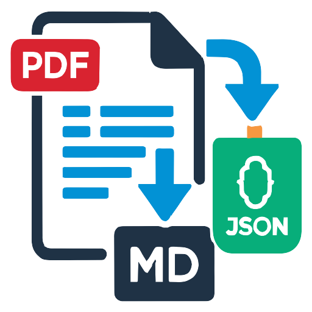

# Document Converter Plugin for IntelliJ IDEA

<p align="center">
  
</p>

Document Converter is an IntelliJ IDEA plugin that allows you to transform your documents (such as PDF files) into Markdown or JSON formats effortlessly. It supports both cloud-based OCR via Mistral AI and offline conversion using MarkItDown.

## Features

- **Multi-format Support**: Convert PDF files and folders recursively.
- **OCR Integration**: High-quality content extraction using Mistral AI OCR.
- **Offline Mode**: Convert documents locally using MarkItDown (no API key required).
- **Flexible Output**: Choose between Markdown (with images) and JSON formats.
- **Smart Overwrite Policies**: Skip existing files, overwrite, or add numeric suffixes.
- **IDE Integration**: Project View context actions, keyboard shortcuts (Ctrl+Alt+M), and a dedicated settings page.

## Requirements

- **IntelliJ IDEA**: 2024.3+ (Build 243+)
- **Runtime**: JBR/Java 17+
- **Offline Mode**: [MarkItDown](https://github.com/microsoft/markitdown) CLI must be installed and available on your PATH.

## Installation

1. Open IntelliJ IDEA.
2. Go to `Settings/Preferences` → `Plugins`.
3. Search for **Document Converter** in the Marketplace (once published).
4. Click **Install**.

## Configuration

1. Open `Settings/Preferences` → `Tools` → **Document Converter**.
2. **Mistral AI Mode**:
   - Provide your Mistral AI API key (stored securely via PasswordSafe).
   - Use the **Test Connection** button to verify.
3. **Offline Mode**:
   - Ensure `markitdown` is installed.
   - You can specify the full path to the `markitdown` executable if it's not on your PATH.
   - Use **Check MarkItDown** to verify.

## Usage


1. In the **Project** tool window, right-click one or more PDF files or a directory.
2. Select **Convert Document**.
3. Configure output options in the dialog.
4. Monitor progress in the background.
5. Upon completion, the generated files will be placed in a subfolder named after the original document.

## How to Publish to JetBrains Marketplace

To publish your plugin to the official JetBrains Marketplace, follow these steps:

1.  **Build the Distribution**:
    - Run the following command in the project root:
      ```bash
      ./gradlew buildPlugin
      ```
    - The generated plugin ZIP file will be located at `build/distributions/DocumentConverter-0.0.1.zip`.

2.  **Prepare for Marketplace**:
    - Ensure your `plugin.xml` has a unique `<id>`, `<name>`, and a detailed `<description>`.
    - Provide a high-quality icon (`src/main/resources/META-INF/pluginIcon.svg`).

3.  **Upload to Marketplace**:
    - Sign in to [JetBrains Marketplace](https://plugins.jetbrains.com/) with your JetBrains Account.
    - Click on your profile and select **Upload plugin**.
    - Drag and drop the ZIP file generated in step 1.
    - Fill in the required metadata (category, tags, etc.) and submit for review.

4.  **Automated Publishing (Recommended)**:
    - Generate a **Permanent Token** in your Marketplace profile.
    - Set the `ORG_GRADLE_PROJECT_intellijPublishToken` environment variable or add it to `gradle.properties`.
    - Run:
      ```bash
      ./gradlew publishPlugin
      ```

## Build & Run (Development)

- **Run IDE with Plugin**: `./gradlew runIde`
- **Run Tests**: `./gradlew test`
- **Verify Plugin**: `./gradlew verifyPlugin`

## License

This project is licensed under the MIT License.
